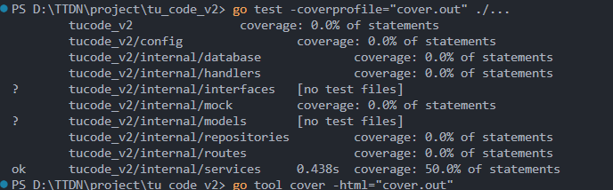
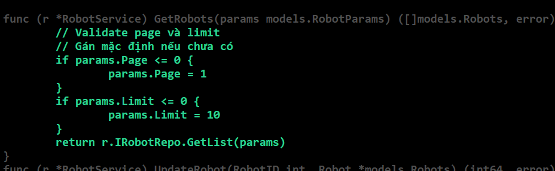

# BE_Engineer_test

Dự án xây dựng hệ thống API quản lý Robot sử dụng Golang và PostgreSQL.

## 🏗️ Cấu trúc source code

Source code được tổ chức theo mô hình **OOP** với các package chính:

- `models/`: Chứa các struct mô tả dữ liệu (mapping với bảng trong DB).
- `repositories/`: Chứa các hàm làm việc trực tiếp với database (truy vấn, thêm, sửa...).
- `services/`: Chứa logic nghiệp vụ xử lý trước khi trả dữ liệu cho client.
- `handlers/`: Chứa các hàm handler để xử lý HTTP request.
- `interfaces/`: Chứa định nghĩa các interface giúp tách biệt giữa logic nghiệp vụ và data layer.
- `routes/`: Định nghĩa các route API cho ứng dụng.
- `config/`: Cấu hình kết nối database và biến môi trường.
- `main.go`: File khởi động ứng dụng.

## 🛠️ Công nghệ sử dụng

- **Golang**: Ngôn ngữ lập trình đơn giản, hiệu suất cao, dễ bảo trì.
- **Gin**: Web framework nhẹ và nhanh cho việc xây dựng RESTful API.
- **PostgreSQL**: CSDL mạnh mẽ, hỗ trợ truy vấn phức tạp và quản lý dữ liệu tốt.
- **godotenv**: Đọc các biến môi trường từ `.env` giúp dễ cấu hình.

## 🧪 Các bước để viết một API mới

1. **Xác định yêu cầu**: Đầu vào, đầu ra và nghiệp vụ cần xử lý.
2. **Tạo model**: Định nghĩa struct tương ứng trong `models/`.
3. **Tạo repository**: Viết hàm truy vấn DB trong `repositories/`.
4. **Tạo service**: Xử lý logic nghiệp vụ trong `services/`.
5. **Tạo handler**: Viết hàm handler nhận request và trả response trong `handlers/`.
6. **Đăng ký route**: Thêm endpoint vào `routes/`.
7. **Chạy thử và test API**.
   > - http://localhost:8080/robots?country_of_origin=vietnam&color=red&production_date_from=2023-02-9&production_date_to=2023-02-13&sort_by=weight
## 🔧 Cài đặt & chạy

```bash
# Khởi tạo module
go mod init tucode_v2

# Cài đặt các thư viện cần thiết
go get github.com/gin-gonic/gin
go get github.com/lib/pq
go get github.com/joho/godotenv
go get github.com/lib/pq
go get github.com/go-sql-driver/mysql
go get github.com/gin-gonic/gin
go get gorm.io/driver/postgres
go get gorm.io/gorm
go get github.com/stretchr/testify/assert
```

# Chạy test

```bash
go test -coverprofile="cover.out" ./...
go tool cover -html="cover.out"
```

